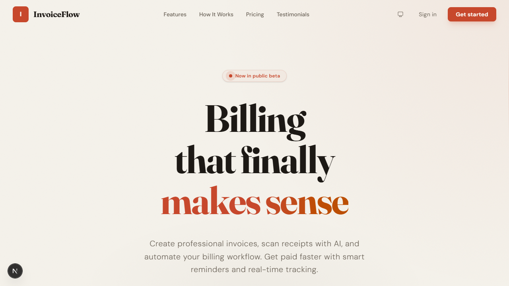
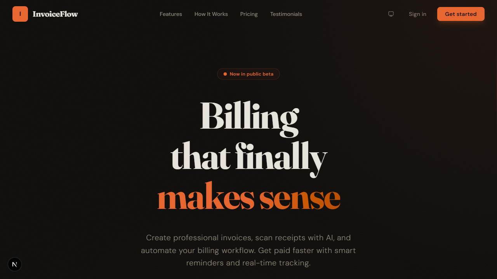
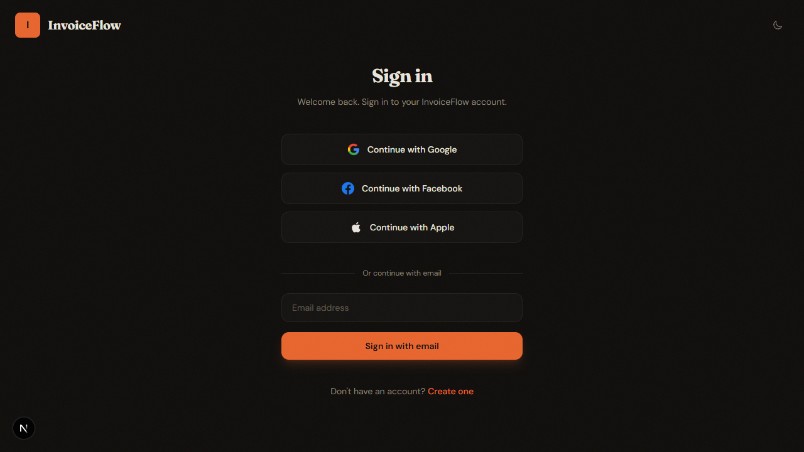

# InvoiceFlow

Smart invoice and receipt management for modern businesses. A marketing landing page built with Next.js 16, React 19, and Tailwind CSS v4.

## Stack

- **Framework**: Next.js 16 (App Router, Turbopack)
- **UI**: React 19 + Tailwind CSS v4
- **Fonts**: Fraunces (serif, display) + DM Sans (sans-serif, body)
- **Language**: TypeScript
- **Linting**: ESLint 9 (flat config)

## Features

- Dark / light / system theme with persistence and no flash
- Google, Facebook, and Apple OAuth sign-in page
- Responsive marketing landing page with 6 sections
- Scroll-to-top, smooth anchor navigation, scroll-aware navbar
- Editorial design with grain texture, staggered animations, animated icons

## Getting Started

```bash
npm install
npm run dev
```

Open [http://localhost:3000](http://localhost:3000).

## Build

```bash
npm run build
npm start
```

## Project Structure

```
src/
├── app/
│   ├── layout.tsx                  # Root: fonts, theme provider, anti-flash script
│   ├── globals.css                 # Design tokens, animations, utilities
│   ├── (marketing)/
│   │   ├── layout.tsx              # Navbar + footer + scroll-to-top
│   │   └── page.tsx                # Homepage (composes sections)
│   └── (auth)/
│       ├── layout.tsx              # Minimal chrome (logo + theme toggle)
│       └── login/
│           └── page.tsx            # OAuth + email sign-in
├── components/
│   ├── icons.tsx                   # 22 SVG icon components
│   ├── ui/                         # Primitives (button, badge, logo, etc.)
│   ├── layout/                     # Chrome (navbar, footer, scroll-to-top)
│   ├── sections/                   # Page content (hero, features, pricing, etc.)
│   └── theme/                      # Theme provider + toggle
└── lib/
    └── data.ts                     # All content data (nav links, pricing, testimonials)
```

## Routes

| Path | Description |
|------|-------------|
| `/` | Marketing landing page (6 sections) |
| `/login` | Sign-in page (OAuth + email) |

## Screenshots

### Hero — Light



### Hero — Dark



### Sign In



To add your own screenshots, drop PNG files into `docs/screenshots/` and reference them with ``. Keep files under 1 MB. Use the Snipping Tool (`Win+Shift+S`) or browser DevTools device toolbar to capture specific viewports.
